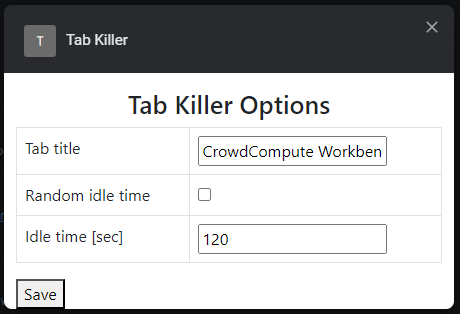

# chrome-tab-killer
Google Chrome extension closing selected tab when user is idle.

## Settings

It is possible to change the requested idle time and the title of the tab that should be closed when the user is inactive. This can be done throgh extension's option panel:

